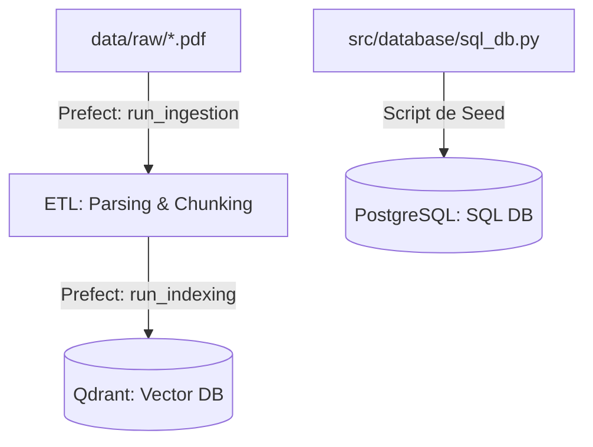
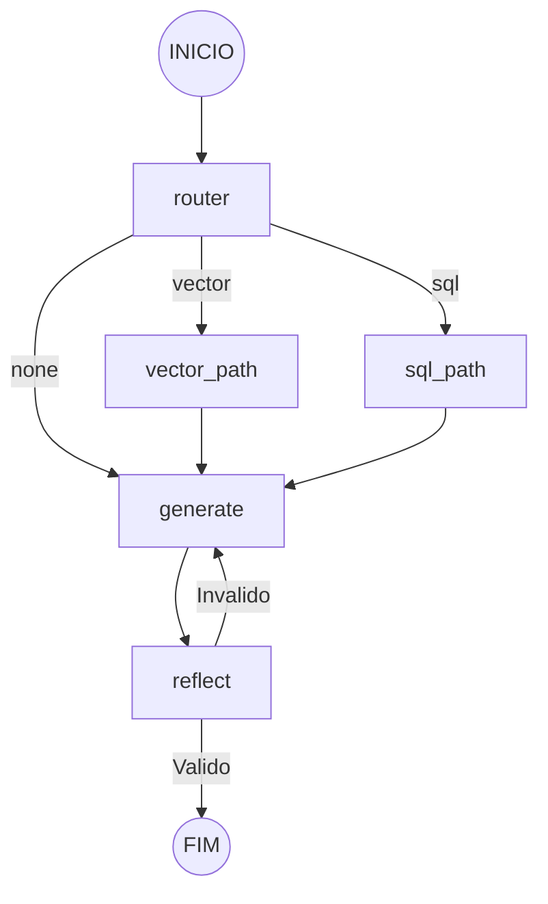

# Manual de Operacao e Arquitetura: Xetroc-AI (v1.0)

Este documento oficial detalha a arquitetura agentica, fluxos de dados e guias de operacao para o ecossistema Xetroc, garantindo a integridade dos processos industriais.

---

## 1. Arquitetura do Sistema

O Xetroc opera em uma infraestrutura moderna de micro-servicos orquestrados via Docker e Prefect:

### Fluxo de Dados (Ingestao e Indexacao)


### Inteligencia Agentica (LangGraph)
O cerebro do sistema utiliza um grafo ciclico com auditoria de qualidade (self-reflection):



---

## 2. Guia de Setup e Inicializacao

### Passo 1: Infraestrutura (Docker)
Levante todos os bancos e servidores de suporte:
```powershell
docker compose up -d --build
```

### Passo 2: Configuracao Prefect (Segredos)
Registre sua OPENAI_API_KEY como um bloco seguro no Prefect e configure a API:
```powershell
prefect config set PREFECT_API_URL="http://127.0.0.1:4200/api"
python src/setup_prefect.py
```

### Passo 3: Deployments e Workers
Registre os fluxos de ETL e inicie o worker para processar as tarefas:
```powershell
python src/etl/deploy_flows.py
# Em um novo terminal, inicie o worker:
prefect worker start --pool default-agent-pool
```

### Passo 4: Dados e PostgreSQL (Seed)
Popule o banco de manutencao industrial com dados de exemplo:
```powershell
python src/database/sql_db.py
```

---

## 3. Manual do Usuario (Interfaces)

### Estacao de Comando (Streamlit)
Acesse a interface principal em: [http://localhost:8502](http://localhost:8502)
- Interacao Agentica: Pergunte sobre normas (ex: "Qual o limite de cinzas...") ou ativos (ex: "Data de instalacao do MOT-402").
- Fontes Transparentes: O Xetroc sempre exibe o nome da norma ou a tabela SQL utilizada para fundamentar a resposta.

### Auditoria de Qualidade (Evidently AI)
Acesse o relatorio de Data Drift e Qualidade em: [http://localhost:8001](http://localhost:8001)
- Monitora se a resposta do modelo esta degradando ou saindo do escopo tecnico esperado.

---

## 4. Localizacao de Logs e Monitoramento

- Servidor Prefect: http://localhost:4200 (Workflows)
- Rastreamento MLFlow: http://localhost:5000 (Latencia e Auditoria de LLM)
- Vector DB (Qdrant): http://localhost:6333/dashboard (Saude da colecao)

---
**Xetroc: Engenharia de Precisao e Seguranca Industrial.**
